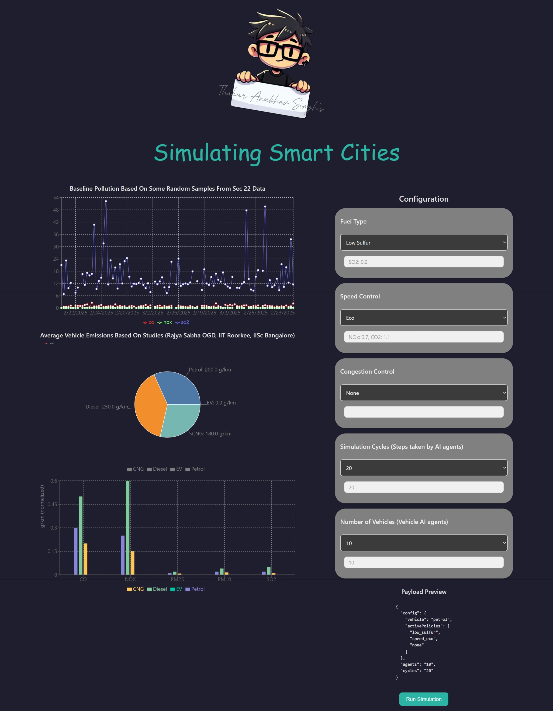
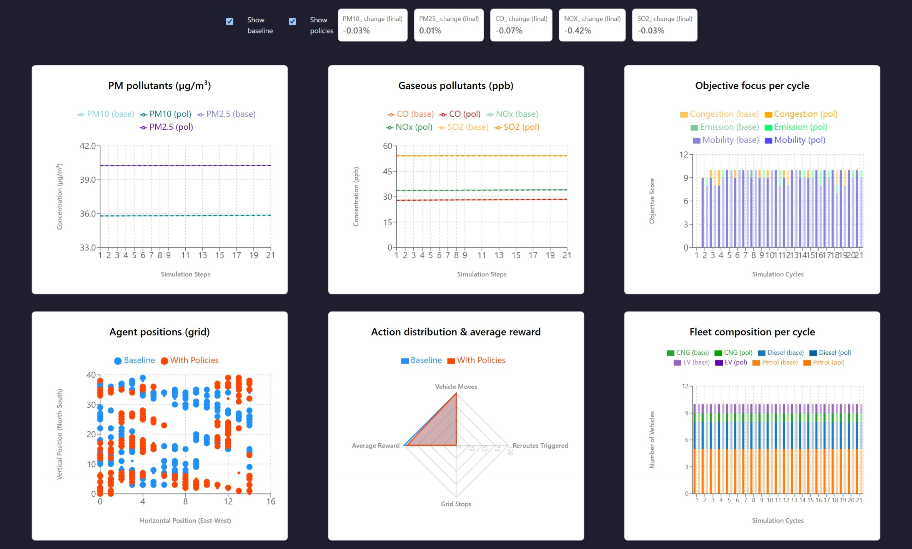

# Smart Cities: Explainable Agentic Framework for Policy Counterfactual and Behavior Analysis

## Description

This repository contains the simulation engine, middleware, and visualization dashboard for a modular agent-based framework designed to simulate urban traffic emissions and smart city pollution dynamics.

The project addresses key gaps identified in recent literature: reliance on sparse datasets, limited interpretability, poor scalability, and neglect of behavioral heterogeneity and policy dynamics. By integrating heterogeneous fleet modeling and policy intervention tools, Simu-Smart-City provides a transparent and extensible platform for evaluating counterfactual scenarios in urban environments.

The architecture is built on a three-tier design:

- A Python backend (Mesa + FastAPI) serving as the ML service center for agent logic and reinforcement learning.
- A Node.js middleware ensuring responsiveness and bridging the computational backend with the frontend.
- A ReactJS dashboard for configuring simulations and visualizing pollutant metrics in real time.

---

## Features

### The 3-Tier Production Architecture

To ensure high performance and prevent UI bottlenecking during complex multi-agent simulation ticks, the system is divided into three distinct layers:

1. **Tier 1: Simulation Engine (`Python-BE V2`)**
   - **Stack:** Python, FastAPI, Mesa, Reinforcement Learning.
   - **Role:** Core computational engine. Handles grid-based scaffolding, agent pathfinding, reward shifts, and emission factor calculations. FastAPI exposes APIs for simulation data.

2. **Tier 2: Asynchronous Middleware (`Node-BE`)**
   - **Stack:** Node.js, Express.
   - **Role:** High-speed traffic controller. Bridges Python-BE and React FE, offloading lightweight tasks and routing ML requests to Python. Ensures responsiveness under heavy simulation loads.

3. **Tier 3: Spatial Dashboard (`simu-smart-city-fe`)**
   - **Stack:** ReactJS.
   - **Role:** Interactive frontend. Configures simulation parameters (fleet distributions, policy toggles) and renders real-time outputs (scatter plots, radar charts, pollutant metrics).

### Agent Behavior & Policy Intervention

- **Heterogeneous Fleet Simulation:** Randomized petrol, diesel, CNG, and EV agents with empirically grounded emission metrics.
- **Dynamic Policy Interventions:** Eco-driving incentives, low-sulfur fuel mandates, and congestion taxation.
- **Behavioral Adaptation:** Agents reroute, stop, or shift strategies under policy constraints, proving that regulations restructure ground-level pathfinding logic.

## Dashboard & Simulation Screenshots






---

## Installation

Dependencies are managed individually within each tier.

```bash
# Clone the repository
git clone https://github.com/Anubhavthakur1996/Simu-Smart-City.git
cd Simu-Smart-City

# Please refer to the specific sub-READMEs in each core directory
# for detailed setup instructions, environment variables, and dependency installation.
```

- **Python Backend:** See `Python-BE V2 (With mesa and RL)/README.md`
- **Node Middleware:** See `Node-BE/README.md`
- **React Frontend:** See `simu-smart-city-fe/README.md`

---

## Usage

To run the full simulation stack locally, each tier must be initialized in a separate terminal instance:

```bash
# 1. Start Python/Mesa Simulation Engine
cd "Python-BE V2 (With mesa and RL)"
# (Execute FastAPI run command as detailed in sub-README)

# 2. Start Node Middleware
cd Node-BE
npm start

# 3. Launch React Dashboard
cd simu-smart-city-fe
npm start
```

---

## Project Structure

```text
Simu-Smart-City/
├── Python-BE V2 (With mesa and RL)/ # Core Python backend (FastAPI, Mesa, RL models)
├── Node-BE/                         # Node.js intermediary routing layer
├── simu-smart-city-fe/              # ReactJS configuration and visualization frontend
├── data/                            # Empirical datasets (Sector 22 Chandigarh, OpenAQ, Rajya Sabha OGD)
├── experiments/                     # [Legacy] Early Mesa forecasting prototypes
├── Python-BE (Base no libraries)/   # [Legacy] Initial backend scaffolding
├── FirstBasicProto.py               # [Legacy] Early logic prototyping
├── PetrolVehicleAgent.py            # [Legacy] Isolated agent testing
├── VehiAgent.py                     # [Legacy] Isolated agent testing
└── VehiEmiAgent.py                  # [Legacy] Isolated agent testing
```

---

## Legacy & Experimental Scaffolding

_Note on repository evolution:_ The repository includes early prototypes and scaffolding (`experiments/`, `Python-BE (Base no libraries)/`, and standalone agent scripts). These were part of the learning process and are kept for transparency, but the main production workflow resides strictly within the three core tiers.

---

## Scalability Roadmap & Synthetic Data Integration

To address the data sparsity gaps mentioned above, this simulation framework is designed to be integrated with a separate **DoppelGANger synthetic data pipeline** (housed in an independent repository).

That associated research focuses on generating high-fidelity, multivariate atmospheric data trained on Sector 22, Chandigarh air quality datasets, validated through KS/JS divergence tests and TSTR utility checks. Future iterations of this Simu-Smart-City platform will consume that synthetic data to test vehicular behavioral adaptation against extreme, counterfactual meteorological scenarios.

---

## Abstract

The urban vehicular emission remains a challenge for smart city design as rising vehicle density directly impacts public health. Continuous exposure to fine particulate matter and gaseous pollutants has been linked to respiratory and cardiovascular risks. Thus, underscoring the urgency for frameworks that go beyond statistical predictions. Existing models often forecast pollution levels with high accuracy but they remain limited in terms of capturing the behavioral tendencies of drivers and the spatial consequences of regulatory interventions. In dense cities, the relationship between mobility needs, emission costs, and congestion dynamics needs approaches that can provide insights into both chemical and behavioral shifts. This paper proposes an agent-based sandbox framework, integrating toroidal grid, ambient air data from sector 22 Chandigarh, India (OpenAQ) to study driver behavior, counterfactuals, and emissions under policy interventions. Across a 20-cycle simulation and Eco-Speed + Low Sulfur Fuel constraints, the framework demonstrates modest reductions in gaseous (-0.42% NOx, -0.08% CO) and a slight increase in PM2.5(+0.01%) pollutants, a consequence of extended transit durations and localized micro-congestions. The agents show mobility bias, a realistic behavior mirroring driver tendency in dense urban cities. This work establishes a scalable architectural blueprint rather than a finalized deployment, providing a vital interpretive tool to preview microscopic agent adaptation and map systemic trade-offs before environmental policies are ever implemented in physical infrastructure.

---

## Tech Stack

### Python Backend (`Python-BE V2`)

- **FastAPI** — Web framework
- **Pydantic** — Data validation
- **Mesa** — Agent-based modeling
- **NumPy & Pandas** — Data processing
- **Plotly** — Data visualization
- **scikit-learn & PyTorch** — Machine learning

### Node.js Middleware (`Node-BE`)

- **Express** — Web framework
- **Axios** — HTTP client
- **Pino** — Logging
- **CORS** — Cross-origin middleware

### Frontend (`simu-smart-city-fe`)

- **React 19** — UI library
- **Vite** — Build tool
- **TypeScript** — Type checking
- **Redux Toolkit** — State management
- **React Router** — Routing
- **Recharts** — Data visualization
- **Sass** — CSS preprocessing
- **ESLint** — Code linting

## How to Cite

If you use this dataset, codebase, or methodology in your research, please cite our paper:

**Plain Text:**

> Anubhav Singh, T. (2026). _Smart Cities: Explainable Agentic Framework for Policy Counterfactual and Behavior Analysis_. (Manuscript in preparation/Under review).

**BibTeX:**

```bibtex
@article{thakuranubhavsingh2026agenticai,
  title={Smart Cities: Explainable Agentic Framework for Policy Counterfactual and Behavior Analysis},
  author={[Singh], [Thakur Anubhav]},
  journal={TBD},
  year={2026}
}

---

## Contributing

1. Fork the repository
2. Create a feature branch
3. Commit your changes
4. Push to the branch
5. Open a Pull Request

---

## License

This project is licensed under the MIT License - see the LICENSE file for details.

---

## Author

Thakur Anubhav Singh
(anubhavthakur1996@outlook.com)
```
